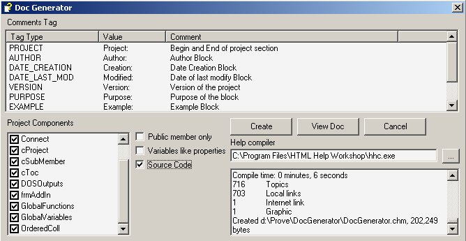



## Add\-in to generate CHM documentation from source code

### Description

This Add-in for Visual Basic 6.0 generate a documentation in CHM format directly from code comments.

It's possible to generate a technical documentation for ActiveX components or a complete developer documentation, for the management of Visual Basic projects.

The Full Auto-Documentation shows how to generate a correct documentation.
 
### More Info
 

             |
---                |---
**Submitted On**   |2002-03-13 16:20:36
**By**             |[Marco Pipino](https://github.com/Planet-Source-Code/PSCIndex/blob/master/ByAuthor/marco-pipino.md)
**Level**          |Advanced
**User Rating**    |5.0 (85 globes from 17 users)
**Compatibility**  |VB 6\.0
**Category**       |[Miscellaneous](https://github.com/Planet-Source-Code/PSCIndex/blob/master/ByCategory/miscellaneous__1-1.md)
**World**          |[Visual Basic](https://github.com/Planet-Source-Code/PSCIndex/blob/master/ByWorld/visual-basic.md)
**Archive File**   |[Add\-in\_to\_620243142002\.zip](https://github.com/Planet-Source-Code/marco-pipino-add-in-to-generate-chm-documentation-from-source-code__1-32674/archive/master.zip)

